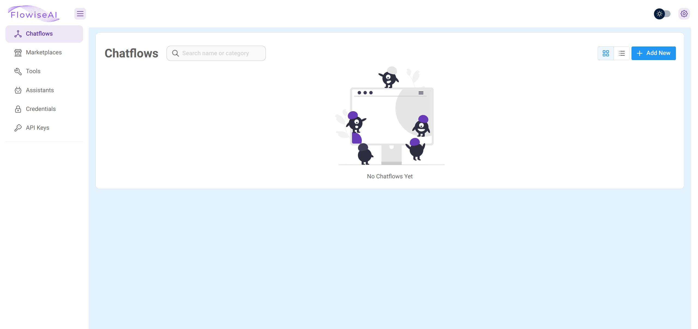
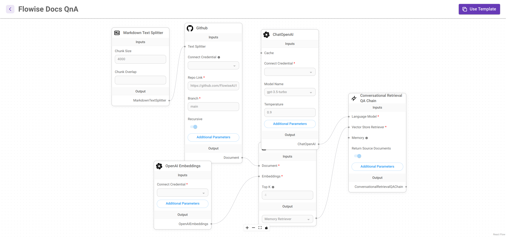
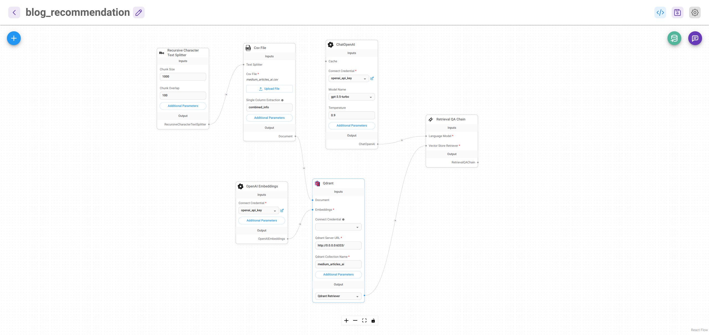
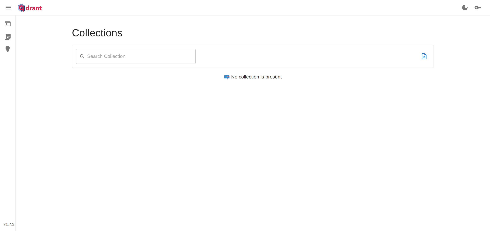
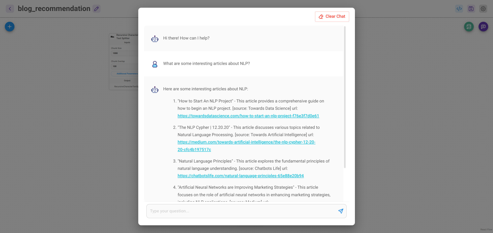

## Boosting Your Blog Recommendations with Flowise & Qdrant: A Step-by-Step Guide

Looking to incorporate a recommendation module to your blog website? Something which would help you recommend high quality, personalised blogs to your users based on their interests and preferenes? Don't have the time to acquaint yourself with machine learning algorithms, models, and python programming? This tutorial will help you out in building a high quality blog recommendation application by using the latest open-source no-code tools and large language models. 

Specifically, we would use Flowise - the no code alternative to Langchain, Qdrant, an open-source vector database and OpenAI's GPT-3.5 model.

Following are the steps you need to take to ensure you have all the tools at your disposal, before we begin using them to build the blog recommender.
1. You need to ensure that you have an OpenAI API key, which, if not, can be obtained by following this link.
2. You need to also obtain a Qdrant API key.
3. Need to install Flowise in your machine or cloud. 

#### Install Flowise ([Official documentation](https://docs.flowiseai.com/getting-started))

1. Download and Install [NodeJS >= 18.15.0](https://nodejs.org/en/download)

2. Install Flowise:

```
npm install -g flowise
```

3. Start Flowise:

```
npx flowise start
```

4. Open http://localhost:3000

#### You can now see a similar page open up in your browser


The chatflow is the place where you can plug-in different components to create an LLM app. Notice on the left hand pane, apart from chatflow you have got other options as well. You can explore the marketplace to use some ready-made LLM app flows, e.g. conversation agent, QnA agent, etc.

For now, lets' try out the Flowise Docs QnA template. Click on it and you can see the template as connected blocks. These blocks, also called nodes, are essential compontents in any LLM app. Think of them as functions when one programmtically creates an LLM app via Langchain or LlamaIndex.



These nodes are explained herein:

1. You have got text splitter for chunking large documents, where you can specify the relevant parameters like chunk size and chunk overlap. 
2. Text splitter is connected to a document source, in this case, the Flowise github repo. ou need to specify the connect credential, which is essential any form of authorisation such as api key, needed to access the source documents. 
3. There is an embedding model, in this case OpenAI embeddings and therefore you need the OpenAI API key as connect credential.
4. The embedding model and the document source is connected to the vector store, wherein the chunked and embedded documents are indexed and stored for retrieval.
5. We also have the LLM model, in this case, ChatOpenAI model from Open AI. 
6. The LLM and the output of the vector store are input to the Converational Retrieval QA chain, which is a chain of prompts meant to perform the required task - chatting with the LLM over the Flowise documentation.

On the top right, you can see the Use template button. We can use this template as a starting point of our recommendation app.

As we see, the first things we need to build a recommendation system is a set of documents. We need a pool of blog articles from which our LLM agent can recommend blogs.
One can either scrape blogs from the internet using some scraper node like **Cheerio Web Scraper**  in Flowise. Or one can have a collection of blogs in disk to be loaded via a document loader.


Fortunately, I could find a well scraped, clean collection of medium blogs on diverse topics in [Hugging Face datasets](https://huggingface.co/datasets/fabiochiu/medium-articles). Clicking on this link and going to the File and Versions tab, one can download the 1.04 GB file named **medium_articles.csv**. 

In the below cells, I show how to use this file to create the LLM blog recommendation agent.

First we need to import the libraries required to load and process the dataset


```python
import pandas as pd
import ast

# replace the file path as appropriate
file_path = "./data/medium_articles.csv"

df = pd.read_csv(file_path)
df.head()

```


<div>
<style scoped>
    .dataframe tbody tr th:only-of-type {
        vertical-align: middle;
    }

    .dataframe tbody tr th {
        vertical-align: top;
    }

    .dataframe thead th {
        text-align: right;
    }
</style>
<table border="1" class="dataframe">
  <thead>
    <tr style="text-align: right;">
      <th></th>
      <th>title</th>
      <th>text</th>
      <th>url</th>
      <th>authors</th>
      <th>timestamp</th>
      <th>tags</th>
    </tr>
  </thead>
  <tbody>
    <tr>
      <th>0</th>
      <td>Mental Note Vol. 24</td>
      <td>Photo by Josh Riemer on Unsplash\n\nMerry Chri...</td>
      <td>https://medium.com/invisible-illness/mental-no...</td>
      <td>['Ryan Fan']</td>
      <td>2020-12-26 03:38:10.479000+00:00</td>
      <td>['Mental Health', 'Health', 'Psychology', 'Sci...</td>
    </tr>
    <tr>
      <th>1</th>
      <td>Your Brain On Coronavirus</td>
      <td>Your Brain On Coronavirus\n\nA guide to the cu...</td>
      <td>https://medium.com/age-of-awareness/how-the-pa...</td>
      <td>['Simon Spichak']</td>
      <td>2020-09-23 22:10:17.126000+00:00</td>
      <td>['Mental Health', 'Coronavirus', 'Science', 'P...</td>
    </tr>
    <tr>
      <th>2</th>
      <td>Mind Your Nose</td>
      <td>Mind Your Nose\n\nHow smell training can chang...</td>
      <td>https://medium.com/neodotlife/mind-your-nose-f...</td>
      <td>[]</td>
      <td>2020-10-10 20:17:37.132000+00:00</td>
      <td>['Biotechnology', 'Neuroscience', 'Brain', 'We...</td>
    </tr>
    <tr>
      <th>3</th>
      <td>The 4 Purposes of Dreams</td>
      <td>Passionate about the synergy between science a...</td>
      <td>https://medium.com/science-for-real/the-4-purp...</td>
      <td>['Eshan Samaranayake']</td>
      <td>2020-12-21 16:05:19.524000+00:00</td>
      <td>['Health', 'Neuroscience', 'Mental Health', 'P...</td>
    </tr>
    <tr>
      <th>4</th>
      <td>Surviving a Rod Through the Head</td>
      <td>You’ve heard of him, haven’t you? Phineas Gage...</td>
      <td>https://medium.com/live-your-life-on-purpose/s...</td>
      <td>['Rishav Sinha']</td>
      <td>2020-02-26 00:01:01.576000+00:00</td>
      <td>['Brain', 'Health', 'Development', 'Psychology...</td>
    </tr>
  </tbody>
</table>
</div>


```python
# some basic info about the dataframe
print(df.info())
```

    <class 'pandas.core.frame.DataFrame'>
    RangeIndex: 192368 entries, 0 to 192367
    Data columns (total 6 columns):
     #   Column     Non-Null Count   Dtype 
    ---  ------     --------------   ----- 
     0   title      192363 non-null  object
     1   text       192368 non-null  object
     2   url        192368 non-null  object
     3   authors    192368 non-null  object
     4   timestamp  192366 non-null  object
     5   tags       192368 non-null  object
    dtypes: object(6)
    memory usage: 8.8+ MB
    None


We see that there are close to 200k articles in this dataset. We don't need these many articles in our pool to recommend from. 

Therefore, we focus only on a niche domain, 'AI'. We sample only those articles which include 'AI' as a tag.


```python
# first converting the tags values from string to a list for the explode operation
df['tags'] = df.tags.apply(lambda d: ast.literal_eval(d))
df = df.explode('tags')
df.head()
```


<div>
<style scoped>
    .dataframe tbody tr th:only-of-type {
        vertical-align: middle;
    }

    .dataframe tbody tr th {
        vertical-align: top;
    }

    .dataframe thead th {
        text-align: right;
    }
</style>
<table border="1" class="dataframe">
  <thead>
    <tr style="text-align: right;">
      <th></th>
      <th>title</th>
      <th>text</th>
      <th>url</th>
      <th>authors</th>
      <th>timestamp</th>
      <th>tags</th>
    </tr>
  </thead>
  <tbody>
    <tr>
      <th>0</th>
      <td>Mental Note Vol. 24</td>
      <td>Photo by Josh Riemer on Unsplash\n\nMerry Chri...</td>
      <td>https://medium.com/invisible-illness/mental-no...</td>
      <td>['Ryan Fan']</td>
      <td>2020-12-26 03:38:10.479000+00:00</td>
      <td>Mental Health</td>
    </tr>
    <tr>
      <th>0</th>
      <td>Mental Note Vol. 24</td>
      <td>Photo by Josh Riemer on Unsplash\n\nMerry Chri...</td>
      <td>https://medium.com/invisible-illness/mental-no...</td>
      <td>['Ryan Fan']</td>
      <td>2020-12-26 03:38:10.479000+00:00</td>
      <td>Health</td>
    </tr>
    <tr>
      <th>0</th>
      <td>Mental Note Vol. 24</td>
      <td>Photo by Josh Riemer on Unsplash\n\nMerry Chri...</td>
      <td>https://medium.com/invisible-illness/mental-no...</td>
      <td>['Ryan Fan']</td>
      <td>2020-12-26 03:38:10.479000+00:00</td>
      <td>Psychology</td>
    </tr>
    <tr>
      <th>0</th>
      <td>Mental Note Vol. 24</td>
      <td>Photo by Josh Riemer on Unsplash\n\nMerry Chri...</td>
      <td>https://medium.com/invisible-illness/mental-no...</td>
      <td>['Ryan Fan']</td>
      <td>2020-12-26 03:38:10.479000+00:00</td>
      <td>Science</td>
    </tr>
    <tr>
      <th>0</th>
      <td>Mental Note Vol. 24</td>
      <td>Photo by Josh Riemer on Unsplash\n\nMerry Chri...</td>
      <td>https://medium.com/invisible-illness/mental-no...</td>
      <td>['Ryan Fan']</td>
      <td>2020-12-26 03:38:10.479000+00:00</td>
      <td>Neuroscience</td>
    </tr>
  </tbody>
</table>
</div>


```python
# now we see that the explode operation has duplicated rest of the row for each tag in the tags list
# We can further filter only the AI tagged articles

df_ai = df.query('tags == "AI"')
df_ai.head()
```


<div>
<style scoped>
    .dataframe tbody tr th:only-of-type {
        vertical-align: middle;
    }

    .dataframe tbody tr th {
        vertical-align: top;
    }

    .dataframe thead th {
        text-align: right;
    }
</style>
<table border="1" class="dataframe">
  <thead>
    <tr style="text-align: right;">
      <th></th>
      <th>title</th>
      <th>text</th>
      <th>url</th>
      <th>authors</th>
      <th>timestamp</th>
      <th>tags</th>
    </tr>
  </thead>
  <tbody>
    <tr>
      <th>34</th>
      <td>AI creating Human-Looking Images and Tracking ...</td>
      <td>AI creating Human-Looking Images and Tracking ...</td>
      <td>https://medium.com/towards-artificial-intellig...</td>
      <td>['David Yakobovitch']</td>
      <td>2020-09-07 18:01:01.467000+00:00</td>
      <td>AI</td>
    </tr>
    <tr>
      <th>69</th>
      <td>Predicting The Protein Structures Using AI</td>
      <td>Proteins are found essentially in all organism...</td>
      <td>https://medium.com/datadriveninvestor/predicti...</td>
      <td>['Vishnu Aravindhan']</td>
      <td>2020-12-26 08:46:36.656000+00:00</td>
      <td>AI</td>
    </tr>
    <tr>
      <th>72</th>
      <td>Unleash the Potential of AI in Circular Econom...</td>
      <td>Business Potential of AI in promoting circular...</td>
      <td>https://medium.com/swlh/unleash-the-potential-...</td>
      <td>['Americana Chen']</td>
      <td>2020-12-07 22:46:53.490000+00:00</td>
      <td>AI</td>
    </tr>
    <tr>
      <th>85</th>
      <td>Essential OpenCV Functions to Get You Started ...</td>
      <td>Reading, writing and displaying images\n\nBefo...</td>
      <td>https://towardsdatascience.com/essential-openc...</td>
      <td>['Juan Cruz Martinez']</td>
      <td>2020-06-12 16:03:06.663000+00:00</td>
      <td>AI</td>
    </tr>
    <tr>
      <th>105</th>
      <td>Google Objectron — A giant leap for the 3D obj...</td>
      <td>bjecrPhoto by Tamara Gak on Unsplash\n\nGoogle...</td>
      <td>https://towardsdatascience.com/google-objectro...</td>
      <td>['Jair Ribeiro']</td>
      <td>2020-11-23 17:48:03.183000+00:00</td>
      <td>AI</td>
    </tr>
  </tbody>
</table>
</div>


```python
# Finally, we concatenate information across the columns into a single column, so that we have to index only a single column in the Qdrant vector DB
# Also, we include only use the titles of the article as the summary of its content. This is to minimise the db upsert times (as we will be using Qdrant DB on our local machine)
# We keep the url field, as the LLM agent can cite the url of the recommended blog using this field.
# finally, we take a random sample of 200 articles, again to minimise the db upsert times.
df_ai.loc[:, 'combined_info'] = df_ai.apply(lambda row: f"title: {row['title']}, url: {row['url']}", axis=1)
df_ai_combined = df_ai['combined_info']
df_ai_combined.sample(200).to_csv('medium_articles_ai.csv')
df_ai_combined.head()
```


    34     title: AI creating Human-Looking Images and Tr...
    69     title: Predicting The Protein Structures Using...
    72     title: Unleash the Potential of AI in Circular...
    85     title: Essential OpenCV Functions to Get You S...
    105    title: Google Objectron — A giant leap for the...
    Name: combined_info, dtype: object


Now that we have the csv file, we go back to the flowise dashboard.

In the QnA template we discussed earlier, replace the MarkdownTextsplitter by RecursiveTextSplitter, the Github Document Loader with the CSV document loader, the In-memory retrieval with the Qdrant vector store and the Conversational Retrieval Chain with the Retrieval QA Chain.

Also, in the CSV document loader, upload the csv file we created in the above cell, putting 'combined_info' in the 'Single Column Extraction' field. Also, ensure that you put down your OpenAI API keys, the Qdrant server URL as 'http://0.0.0.0:6333' and give a new collection (database) name. 

The dashboard looks like this now:




You can save your chatflow using the save icon on the top right, and can run the flow using the green coloured database icon below it.

But before proceeding, you need to firstly start a local Qdrant server. The easiest way to do is via docker. Ensure you have [docker](https://docs.docker.com/engine/install/) installed in your system. Then, go to a terminal and paste the following commands:

```
docker pull qdrant/qdrant
docker run -p 6333:6333 qdrant/qdrant
```

You can then go to your browser at [http://localhost:6333/dashboard](http://localhost:6333/dashboard) and see the Qdrant dashboard. We will come back to this dashboard later.



Run the flow now, using the green coloured database icon and click on the upsert button on the pop-up which follows.

Once the documents are upserted into the Qdrant DB, you can do over to the Qdrant DB dashboard at [http://localhost:6333/dashboard](http://localhost:6333/dashboard) and refresh to see the new collection 'medium_articles_ai' created. Click on it to see the indexed csv file. 


Finally, lets start the chatbot by clicking on the purple message icon next to the green database icon.

You can ask the bot about articles in AI and the bot would recommend you the articles from the collection we created with the csv file. Without us instructing it to do so, it also knows to cite the url of the recommended blog, so that the user can straightaway start reading the blogs.



